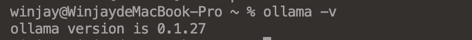

## Ollama是什么

Ollama是一款开源的大型语言模型工具，专注于为用户提供本地化的运行环境，满足个性化的需求。该工具允许用户快速运行Llama2、Code Llama等多种模型，并提供类似于OpenAI的API接口和聊天界面，方便用户部署和使用最新版本的GPT模型。

Ollama将模型权重、配置和数据捆绑到一个包中，定义成Modelfile。它优化了设置和配置细节，包含GPU使用情况。

## 安装Ollama

### 常规安装

> 目前Ollama支持`macOS`、`Linux`、`Windows`3个平台，用户可以根据实际使用平台进行选择。
>
> 

- **macOS平台**

  ```shell
  https://ollama.com/download/mac

- **Linux平台**

  ```shell
  curl -fsSL https://ollama.com/install.sh | sh
  ```

- **Windows平台**

  ```shell
  https://ollama.com/download/windows
  ```

  > [!CAUTION]
  >
  > 需要Windows 10或更高版本，支持Home和Pro版本

### Docker安装

> 可通过Docker Hub下载镜像进行安装

```shell
docker pull ollama/ollama
docker run -d -v ollama:/root/.ollama -p 11434:11434 --name ollama ollama/ollama
```

### 安装验证

> 在命令行窗口中输入以下命令

```shell
ollama -v
```

