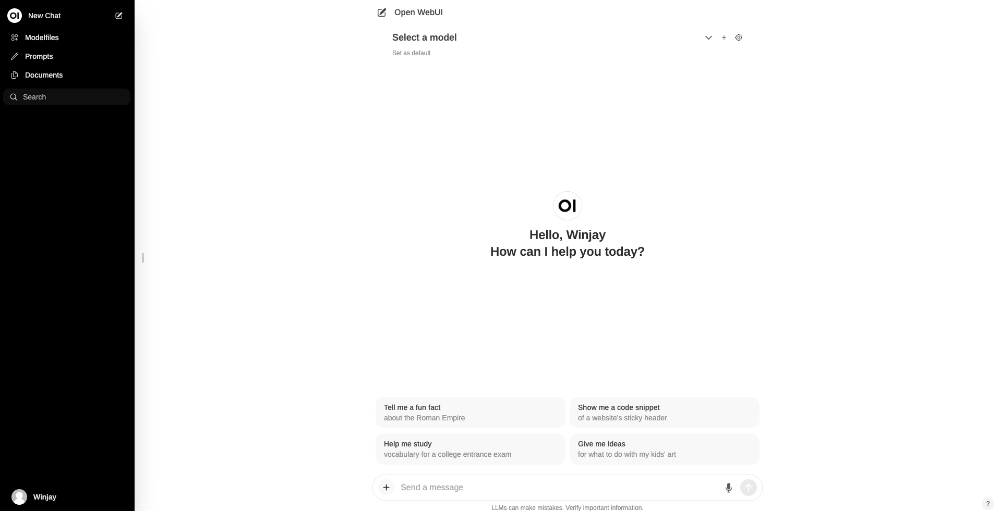

## Open-WebUI是什么

Open WebUI是一个可扩展、功能丰富且用户友好的自托管WebUI工具，适用于各种LLM运行，支持包括在Ollman和兼容OpenAI的API。

## 安装Open-WebUI

> [!IMPORTANT]
>
> 使用Docker安装Open WebUI时，需要确保使用`-v /data/open-webui:/app/backend/data`参数进行挂载数据，防止数据丢失。

- Ollama本地计算机，使用以下命令

  ```shell
  docker run -d -p 3000:8080 --add-host=host.docker.internal:host-gateway -v open-webui:/app/backend/data --name open-webui --restart always ghcr.io/open-webui/open-webui:main
  ```

- Ollama位于其它服务器上，请使用以下命令

  ```shell
  docker run -d -p 3000:8080 -e OLLAMA_API_BASE_URL=https://example.com/api -v open-webui:/app/backend/data --name open-webui --restart always ghcr.io/open-webui/open-webui:main
  ```

  > [!CAUTION]
  >
  > 请更改`OLLAMA_API_BASE_UR`为Ollama所在服务器的URL地址
  >
  > 例如：
  >
  > ```shell
  > docker run -d -p 3000:8080 -e OLLAMA_API_BASE_URL=http://<ip>:11434/api -v /data/open-webui:/app/backend/data --name open-webui --restart always ghcr.io/open-webui/open-webui:main
  > ```
  >
  
## 访问Open-WebUI控制台

在浏览器上访问http://ip:3000，需要先注册一个自己的账号。



